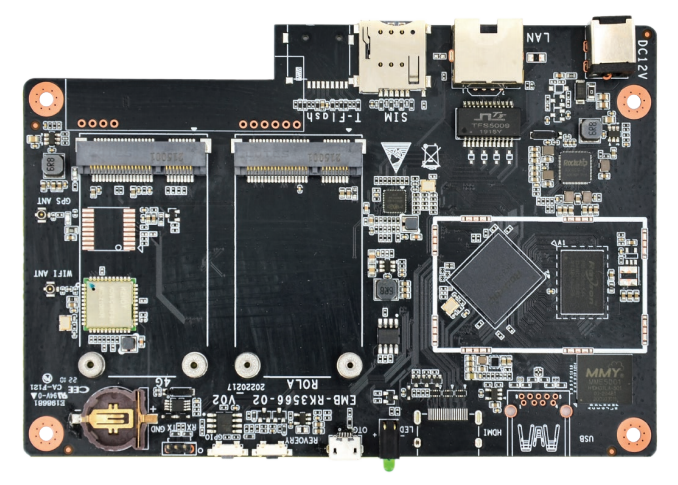
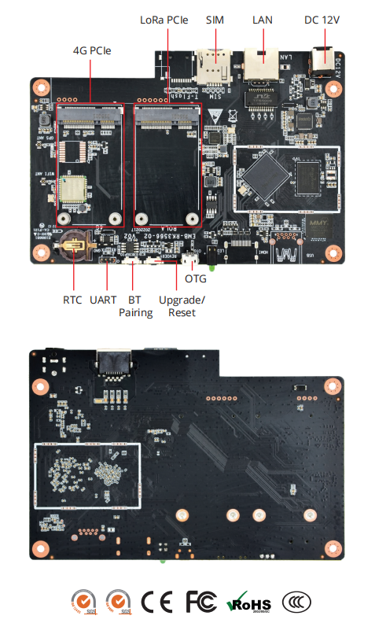
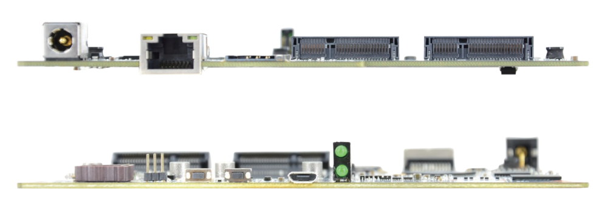

# DEBIX EMB-RK3566-02 Single Board Computer
 

---

### EMB-RK3566-02 Single Board Computer Based on Rockchip RK3566 Quad-core Cortex-A55 CPU

## Specification
| System          |                                                                         |
|-----------------|-------------------------------------------------------------------------|
| CPU             | Rockchip RK3566 Quad-core ARM Cortex-A55 1.8GHz, comes with an integrated neural processing unit (NPU) that delivers up to 1.0 TOPS.  |
| Memory          | 1\) Default: 4GB LPDDR4 (2GB/8GB optional) 2\) 2GB/4GB/8GB LPDDR4X optional  |
| Flash           | 64GB eMMC (8GB/16GB/32GB/128GB/256GB optional)                          |
| OS              | Android, Debian, Yocto                                                  |
|**Communnication**|                                                                      
| RJ45            | 1 x 100/1000M LAN                                                       |
| WiFi & BT       | 2.4GHz Wi-Fi 4, BT4.2                                                        |
| LoRa            | 1 x LoRa Gateway, support 470MHz/868MHz/915MHz                          |
| 4G              | 1 x 4G Module                                                           |
| GPS             | 1 x GPS Module                                                          |
|**I/O Interfaces**|
| USB             | 1 x USB 3.0 (optional), 1 x Micro USB (OTG)                             |
| Serial Port     | 1 x TTL DEBUG                                                           |
| PCIe            | 1 x Mini PCIe (4G), 1 x Mini PCIe (LoRa)                                |
| HDMI            | 1 x HDMI OUT (optional)                                                 |
| Key             | 1 x Bluetooth Pairing Key, 1 x Upgrade/Reset Key                        |
| SIM Slot        | 1 x SIM slot                                                            |
| TF Slot         | 1 x TF slot (optional)                                                  |
| RTC             | 1 x RTC                                                                 |
|**Power Supply**|
| Power Input     | 1 x 12V DC IN                                                           |
|**Mechanical & Environmental**|
| Dimension       | 150mm x 102mm x 11.8mm                                                  |

## I/O Interfaces:

## Safety Instructions and Warnings:
**General:**
- Avoid exposure to water, moisture and conductive surfaces while operating.
- Handle with care to avoid mechanical or electrical damage to the circuit board and connectors.
- Only handle the board by the edges when powered on to minimize the risk of electrostatic discharge damage.

**Power:**
- Use only a 12V DC minimum external power supply that complies with relevant regulations and standards for your country.

**Environment:**
- Operate in a well-ventilated environment, even if using a case.
- Place on a stable, flat, non-conductive surface and avoid contact with conductive items.

**Connections:**
- Use peripherals that comply with relevant standards for the country of use and ensure proper insulation and operation.

**Additional notes:**
- If you are unsure about any aspect of safety or operation, consult a qualified
professional.

## Contact Us
- **Headquarters**: DEBIX Technology Inc., 8345 Gold River Ct., Las Vegas, NV 89113, USA  
- **Factory**: 5-6/F., East Zone, Shunheda A2 Building, Liqxiandong Industrial Park, XiLi, Nanshan Dist., Shenzhen, China  
- **Email**: info@debix.io  
- **Website**: [www.debix.io](https://www.debix.io)  
- **Community**: [Discord](https://discord.com/invite/adaHHaDkH2)